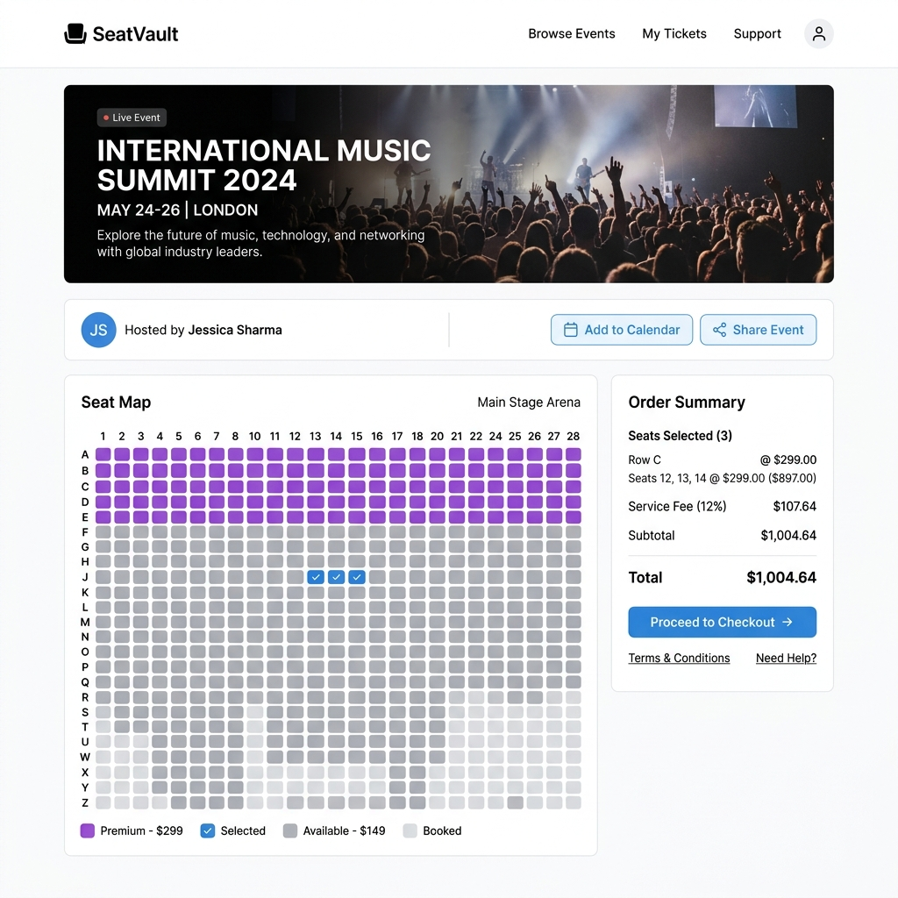

# SeatVault - Enterprise Event Ticket Booking Platform

[](#project-status)
[](https://openjdk.org/projects/jdk/17/)
[](https://spring.io/projects/spring-boot)
[](#code-coverage)

SeatVault is a high-performance, concurrency-safe, enterprise event ticketing platform built with Spring Boot 3, PostgreSQL, Redis, and Vanilla JS. It is designed to handle high-demand ticket drops, zero-overselling guarantees, payment idempotency, virtual waiting rooms, PDF e-ticket generation, gate check-in scanning, and production observability.

---

## 📸 Visual Previews (Luma/District-style Theme)

### Homepage Overview


### Dynamic Booking & Seat Map


---

## 🚀 Project Status

> [!IMPORTANT]
> **Status: FULLY PRODUCTION-READY ENTERPRISE PLATFORM**
>
> All backend services, security controls, queue managers, e-ticket generators, CI quality gates, and observability monitors are fully implemented, tested, and validated.

- **Concurrency & Locking**: Pessimistic/Optimistic row locking with 0% overselling guarantee under extreme concurrent traffic.
- **High-Demand Virtual Waiting Room**: Redis Sorted Set FIFO queue with configurable periodic admission pacing.
- **E-Ticket & Gate Check-in**: OpenPDF document rendering, ZXing QR code generation, and HMAC-SHA256 digital signature verification for gate check-in scanners.
- **JWT Security & Token Revocation**: 15-min access tokens, 7-day Redis refresh tokens, token revocation blocklist, and startup security safety checks.
- **Rate Limiting & Safety**: IP-based rate limiting on public endpoints and hard page-size capping on all pageable queries.
- **Production Observability**: Prometheus metrics (`/actuator/prometheus`), MDC `X-Request-Id` request tracing, and profile-based JSON logging.
- **CI/CD Quality Gates**: 70% line-coverage threshold enforced via JaCoCo in Maven `verify` and Trivy vulnerability scanning failing builds on HIGH/CRITICAL CVEs.

---

## 📐 Architecture Overview

```text
                      ┌──────────────────────────────────────────────┐
                      │             Single-Page Application          │
                      │         (HTML5 / CSS3 / Vanilla JS)          │
                      └──────────────────────┬───────────────────────┘
                                             │ REST / JSON
                                             ▼
                      ┌──────────────────────────────────────────────┐
                      │          Spring Boot 3.3 Gateway             │
                      │ ┌──────────────────────────────────────────┐ │
                      │ │ RequestIdFilter (MDC X-Request-Id)       │ │
                      │ │ RateLimitInterceptor (Redis IP Limiter)  │ │
                      │ │ JwtAuthenticationFilter (Token & Revoc)  │ │
                      │ └──────────────────────────────────────────┘ │
                      └──────┬───────────────────────────────┬───────┘
                             │                               │
                             ▼                               ▼
              ┌──────────────────────────────┐┌──────────────────────────────┐
              │     PostgreSQL Database      ││         Redis Cache          │
              │ ┌──────────────────────────┐ ││ ┌──────────────────────────┐ │
              │ │ Flyway Schema Migrations │ ││ │ FIFO Waiting Room ZSET   │ │
              │ │ Events, Seats, Bookings  │ ││ │ Refresh Tokens & Blacklist│ │
              │ │ Payments, Users (BCrypt) │ ││ │ IP Rate Limit Counters   │ │
              │ └──────────────────────────┘ ││ └──────────────────────────┘ │
              └──────────────────────────────┘└──────────────────────────────┘
```

---

## 🌟 Key Features

### 1. High-Demand Virtual Waiting Room (FIFO Queue)
- Flag events with `high_demand = true`.
- Incoming users hit `POST /api/v1/events/{id}/queue/join` to get a Redis Sorted Set (FIFO) position ticket.
- Clients poll `GET /api/v1/events/{id}/queue/status` until position is admitted.
- `QueueAdmissionScheduler` admits $N$ users every $M$ seconds (configurable).
- Enforces short-lived admission tokens on seat holding (`/bookings/hold`).

### 2. E-Ticket PDF & Gate Check-in Verification
- Generates a PDF ticket per seat using OpenPDF on payment confirmation.
- Renders a ZXing QR Code encoding an HMAC-SHA256 signed token (`<base64Payload>.<signature>`).
- Owner-only PDF download endpoint (`GET /api/v1/bookings/{id}/ticket`).
- Gate scanner verification endpoint (`POST /api/v1/tickets/verify`) accessible by `ADMIN` / `SCANNER` roles. Rejects tampered signatures instantly.

### 3. Concurrency & Idempotency Guarantees
- **Zero Overselling**: Row locks (`SELECT FOR UPDATE` or optimistic retry) guarantee exactly one user holds a seat.
- **Idempotent Payment**: Unique `(booking_id, idempotency_key)` constraint prevents double-charging.
- **Hold Expiry**: Scheduled `HoldReleaseService` releases abandoned holds after 5 minutes.

### 4. JWT Authentication & Token Management
- Short-lived JWT access tokens (15 mins) and long-lived opaque refresh tokens (7 days stored in Redis).
- `POST /api/v1/auth/refresh` exchanges refresh tokens for new access tokens.
- `POST /api/v1/auth/logout` revokes refresh tokens and blocklists the active access token JTI in Redis.

### 5. Production Hardening & Safety
- **Startup Guard**: `ProductionSecurityValidator` halts boot in `prod` profile if `ADMIN_PASSWORD` is `admin12345` or `JWT_SECRET` contains `change-me`.
- **IP Rate Limiting**: Redis atomic Lua script limits unauthenticated public endpoint requests.
- **Query Capping**: Enforces hard limit (`max-page-size: 100`) on all Pageable endpoints.
- **Observability**: Prometheus metrics at `/actuator/prometheus`, MDC `X-Request-Id` tracing, custom metrics (`seat.hold.count`, `payment.count`).

---

## 🛠️ Tech Stack

| Layer | Technology |
| --- | --- |
| **Language & Runtime** | Java 17, Spring Boot 3.3.1 |
| **Database** | PostgreSQL 16, Flyway 10 |
| **Caching & Queue** | Redis 7 (Sorted Sets, String TTLs, Atomic Lua) |
| **Security** | Spring Security 6, JJWT 0.12, BCrypt |
| **PDF & QR Code** | OpenPDF 1.3, ZXing 3.5 |
| **Metrics & Tracing** | Micrometer, Prometheus, Logstash Logback JSON |
| **Testing** | JUnit 5, Mockito, Testcontainers, JaCoCo |
| **CI/CD** | GitHub Actions, Trivy Security Scanner |

---

## 📡 Key REST Endpoints

### Authentication & Tokens
| Method | Endpoint | Access | Description |
| --- | --- | --- | --- |
| `POST` | `/api/v1/auth/register` | Public | Register new user account |
| `POST` | `/api/v1/auth/login` | Public | Authenticate & receive access + refresh token |
| `POST` | `/api/v1/auth/refresh` | Public | Refresh expired access token |
| `POST` | `/api/v1/auth/logout` | Authenticated | Revoke refresh token & blocklist access token |

### Events & Waiting Room
| Method | Endpoint | Access | Description |
| --- | --- | --- | --- |
| `GET` | `/api/v1/events` | Public | List upcoming events (IP rate limited) |
| `GET` | `/api/v1/events/{id}` | Public | Event details |
| `GET` | `/api/v1/events/{id}/seats` | Public | Live seat map status |
| `POST` | `/api/v1/events/{id}/queue/join` | Authenticated | Join Virtual Waiting Room |
| `GET` | `/api/v1/events/{id}/queue/status` | Authenticated | Poll queue position & admission token |
| `POST` | `/api/v1/events` | Admin | Create event with seat grid / tiers |

### Bookings & E-Tickets
| Method | Endpoint | Access | Description |
| --- | --- | --- | --- |
| `POST` | `/api/v1/bookings/hold` | Authenticated | Hold seats (requires admission token if high demand) |
| `POST` | `/api/v1/bookings/{id}/pay` | Authenticated | Idempotent payment approval & confirmation |
| `GET` | `/api/v1/bookings/{id}/ticket` | Owner/Admin | Download PDF E-Ticket |
| `POST` | `/api/v1/tickets/verify` | Admin/Scanner | Verify HMAC signed QR token for check-in |

### Observability
| Method | Endpoint | Access | Description |
| --- | --- | --- | --- |
| `GET` | `/actuator/prometheus` | Public/Ops | Micrometer Prometheus metrics |
| `GET` | `/actuator/health` | Public | Spring Boot health check |

---

## 🧪 Testing & Code Quality

### Running Unit Tests
```bash
./mvnw clean test
```

### Running Full Integration Tests (Testcontainers Postgres + Redis)
```bash
./mvnw clean verify
```
*Note: JaCoCo enforces a minimum **70% line coverage** threshold on the build during `mvn verify`.*

---

## 📄 License
This project is licensed under the MIT License.
