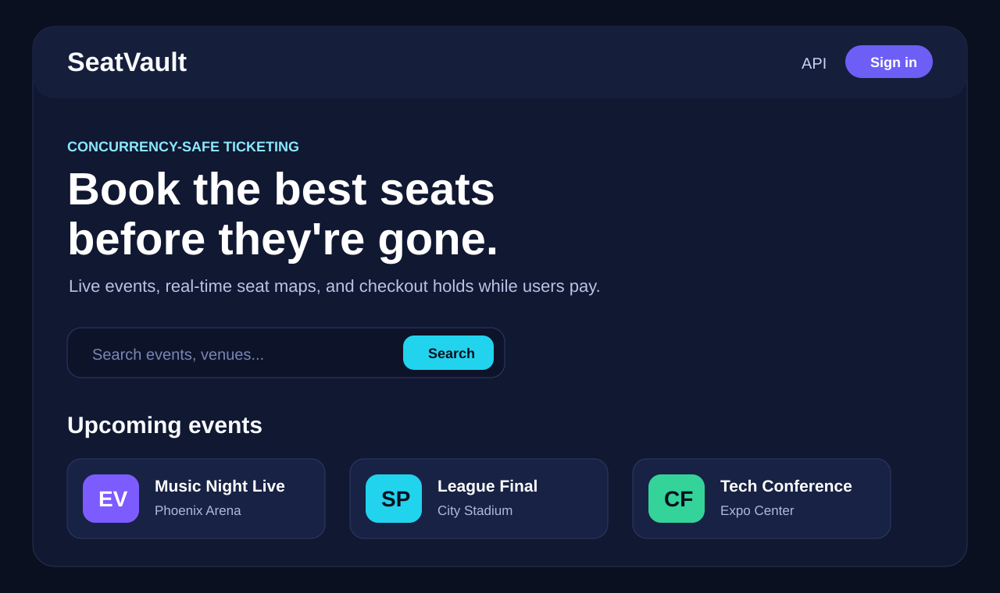
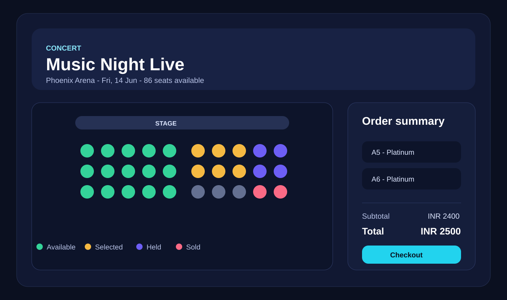
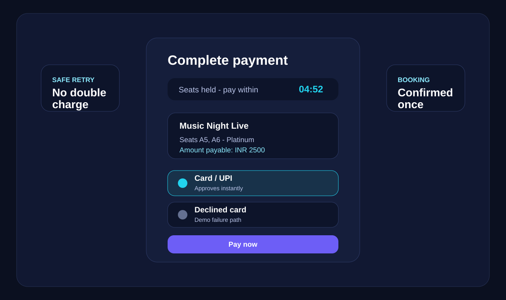

# SeatVault - Event Ticket Booking Platform

SeatVault is a production-style event ticket booking platform built with Spring Boot. It lets users discover events, view live seat availability, hold seats, complete payment, and manage bookings while protecting the system from overselling during high traffic.

The project focuses on real backend engineering problems found in ticketing systems: concurrent seat booking, payment idempotency, expired holds, rate limiting, caching, JWT security, and database-owned pricing.

## Product Output

### Event Discovery

Users can browse upcoming events, search by title or venue, and open an event to view available seats and pricing.



### Live Seat Booking

The booking page shows a live seat map with available, selected, held, and sold seats. Selected seats are priced from backend data and summarized before checkout.



### Checkout And Payment

Seats are temporarily held during checkout. Payment requests use an idempotency key so retrying the same payment does not double-charge the user.



## What This Project Does

- Allows users to register, log in, browse events, select seats, hold tickets, pay, cancel, and view their bookings.
- Allows admins to create and manage events with seat grids, pricing, seat tiers, venue details, and event timing.
- Prevents overselling when many users try to book the same seat at the same time.
- Handles duplicate payment requests safely using idempotency keys.
- Releases expired seat holds automatically so seats do not remain blocked.
- Uses Redis for hot-path caching, rate limiting, and optional distributed locking.
- Documents APIs with Swagger UI and includes automated unit and integration tests.

## Core Engineering Highlights

### Concurrency-Safe Booking

Seat holds are protected with database locking and deterministic ordering, so only one user can successfully hold a seat even under simultaneous requests. The project supports both pessimistic and optimistic locking strategies.

### Idempotent Payment Flow

The payment flow stores a payment attempt using a unique `(booking_id, idempotency_key)` constraint. If the same request is retried, the system returns the original payment result instead of charging again.

### Expired Hold Recovery

Held seats automatically expire after the configured hold window. A scheduled job releases abandoned holds and marks the related bookings as expired.

### Backend-Owned Pricing

Pricing is stored and calculated on the backend. Bookings freeze the final payable amount at hold time, preventing price drift between seat selection and payment.

## Tech Stack

| Area | Technology |
| --- | --- |
| Language | Java 17 |
| Framework | Spring Boot 3.3 |
| Database | PostgreSQL |
| ORM | Spring Data JPA / Hibernate |
| Migrations | Flyway |
| Cache / Rate Limit | Redis |
| Security | Spring Security + JWT |
| API Docs | OpenAPI / Swagger UI |
| Testing | JUnit 5, Mockito, Testcontainers |
| Build | Maven Wrapper |
| Deployment | Docker, Docker Compose |
| UI | Vanilla HTML, CSS, JavaScript served by Spring Boot |

## Main Features

### User Features

- Account registration and login
- JWT-based authentication
- Event browsing and search
- Live seat map
- Seat selection and order summary
- Temporary seat hold
- Payment confirmation
- Payment retry safety
- Booking history
- Booking cancellation

### Admin Features

- Admin-only event creation
- Event metadata management
- Seat grid generation
- Tier-based pricing
- Secure role-based access

### System Features

- Concurrent seat booking protection
- Idempotent payment lifecycle
- Redis-backed rate limiting
- Redis-backed caching
- Scheduled hold expiry
- Consistent API error response format
- Swagger documentation
- Dockerized local environment
- Unit and integration test coverage

## Architecture

```text
Client / SPA
    |
    v
Spring Boot REST Controllers
    |
    v
Service Layer
    |-- AuthService
    |-- EventService
    |-- BookingService
    |-- SeatReservationService
    |-- PaymentService
    |-- HoldReleaseService
    |-- RateLimiterService
    |
    v
PostgreSQL + Redis
```

The application follows a layered architecture. Controllers expose DTO-based REST APIs, services contain business logic, repositories handle persistence, PostgreSQL owns transactional booking state, and Redis supports cache, rate limiting, and optional distributed locks.

## API Overview

| Method | Endpoint | Access | Purpose |
| --- | --- | --- | --- |
| POST | `/api/v1/auth/register` | Public | Register a user |
| POST | `/api/v1/auth/login` | Public | Login and receive JWT |
| GET | `/api/v1/events` | Public | Browse/search events |
| GET | `/api/v1/events/{id}` | Public | View event details |
| GET | `/api/v1/events/{id}/seats` | Public | View event seats |
| POST | `/api/v1/events` | Admin | Create event |
| PUT | `/api/v1/events/{id}` | Admin | Update event |
| DELETE | `/api/v1/events/{id}` | Admin | Delete event |
| POST | `/api/v1/bookings/hold` | User | Hold selected seats |
| POST | `/api/v1/bookings/{id}/pay` | User | Pay for held booking |
| POST | `/api/v1/bookings/{id}/cancel` | User | Cancel pending booking |
| GET | `/api/v1/bookings` | User | List my bookings |
| GET | `/swagger-ui.html` | Public | Swagger API docs |
| GET | `/actuator/health` | Public | Health check |

## Run Locally

### Run With Docker

```bash
docker compose up --build
```

Then open:

- Web UI: `http://localhost:8080`
- Swagger UI: `http://localhost:8080/swagger-ui.html`

### Run App With Local Maven

```bash
docker compose up -d postgres redis
./mvnw spring-boot:run
```

On Windows:

```powershell
docker compose up -d postgres redis
.\mvnw.cmd spring-boot:run
```

## Test

```bash
./mvnw test
./mvnw verify
```

On Windows:

```powershell
.\mvnw.cmd test
.\mvnw.cmd verify
```

`test` runs fast unit tests. `verify` runs the full suite, including Testcontainers integration tests with PostgreSQL and Redis.

## Example Booking Flow

```text
1. User logs in and receives a JWT.
2. User opens an event and selects seats.
3. System creates a temporary hold for the selected seats.
4. User submits payment with an idempotency key.
5. System confirms booking if payment succeeds.
6. If the user abandons checkout, the hold expires and seats become available again.
```

## Project Status

This is a portfolio-ready backend project demonstrating scalable REST API design, transactional booking workflows, concurrency control, secure authentication, payment safety, caching, rate limiting, and production-oriented testing.
